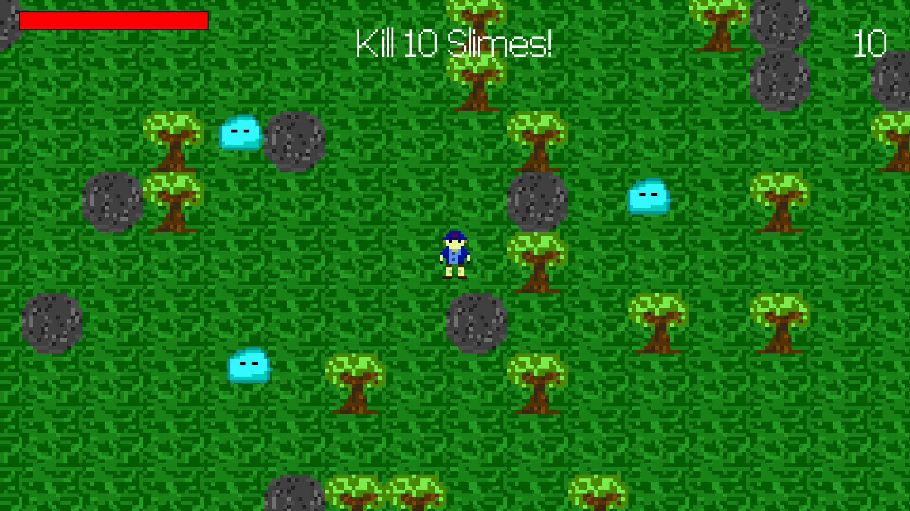

# VING - (VING Is a Nice Game)

## Top down 2d game written in pure C with SDL2 

Tested on Arch Linux with an XBox 360 controller. Game controller is strongly 
recommended.



## Dependencies

Ubuntu:

```bash
sudo apt install libsdl2-2.0-0 libsdl2-image-2.0-0 libsdl2-ttf-2.0-0
```

Arch Linux:

```bash
sudo pacman -S sdl2 sdl2_image sdl2_ttf
```

## Controls

### Keyboard

* Use `wasd` or `hjkl` or `arrows` to walk
* Press `left shift` to dash
* Hold `left shift` and release for long dash
* Press `space` to shoot
* Hold `space` and release for special attack
* Press `q` to quit

### Game controller

* Use `left joystick` or `dpad` to walk
* Press `right trigger` to dash
* Hold `right trigger` and release for long dash
* Press `B button` to shoot
* Hold `B button` and release for special attack

## Compile

```bash
mkdir build
make release
```

## Start game

```bash
build/ving
```

## Options

* `--vsync` - Enable vsync, may perform better or worse, may remove screen tear
* `--windowed` - Start game in windowed mode
